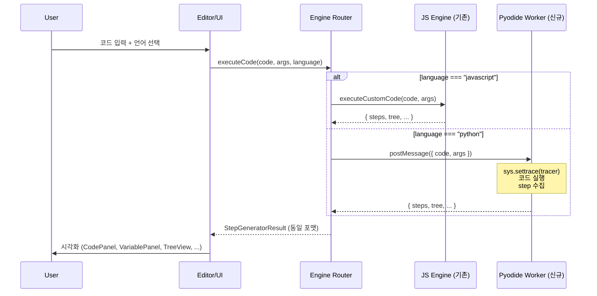

# feat: Add Python execution support via Pyodide

## Overview

JS/TS 전용이던 코드 실행 엔진에 Python을 추가한다. Pyodide(WebAssembly 기반 CPython)를 Web Worker에서 실행하고, `sys.settrace()`로 라인별 추적 + 변수 캡처 + 재귀 호출 트리 구축. 결과를 기존 `Step[]`/`TreeNode` 포맷으로 변환하여 시각화 UI는 수정 없이 재사용.

## Problem Frame

부트캠프/교육 시장에서 Python은 필수. 현재 JS/TS만 지원하여 Python 사용자를 놓치고 있음. PythonTutor처럼 서버 사이드 실행이 아니라 **클라이언트에서 실행**하여 서버 비용 0을 유지.

## Requirements Trace

- R1. Python 코드를 입력하면 JS와 동일하게 라인별 실행 추적 + 변수 캡처
- R2. 재귀 함수 감지 시 호출 트리(TreeNode) 구축
- R3. UI에서 언어 선택 가능 (JavaScript / Python)
- R4. Pyodide는 CDN에서 lazy load (첫 로드 시에만 다운로드, 이후 캐시)
- R5. 로딩 중 사용자에게 진행 상태 표시
- R6. 기존 JS 엔진에 영향 없음 (병렬 파이프라인)
- R7. 동일한 Step/TreeNode/StepGeneratorResult 포맷 출력
- R8. 실행 시간 제한 + 재귀 깊이 제한 (안전 장치)
- R9. Python 프리셋 알고리즘 제공 (정렬, 재귀)

## Scope Boundaries

- Python 전용 패키지(numpy, pandas 등) 지원하지 않음 (순수 Python만)
- stdin/input() 지원하지 않음 (매개변수 기반 실행)
- Python 프리셋은 기본 3-4개만 (추후 확장)
- 서버 사이드 실행 없음 (전부 클라이언트)

## Context & Research

### 현재 JS 엔진 파이프라인

```
analyzeCode(code) → { analysis, strippedCode }
    ↓
transformCode(strippedCode, analysis) → transformed code with __traceLine
    ↓
buildWorkerCode() → Worker 템플릿 (JS 실행 환경)
    ↓
Web Worker: 변환된 코드 실행 → { steps[], tree, finalReturnValue, consoleLogs }
```

### Python 파이프라인 (신규)

```
사용자 Python 코드 + args
    ↓
Pyodide Worker: loadPyodide() (CDN에서 최초 1회)
    ↓
sys.settrace(tracer) → 라인별 추적 + 변수 캡처 + 재귀 트리 구축
    ↓
결과를 Step[]/TreeNode 포맷으로 변환
    ↓
postMessage → 기존 시각화 UI
```

### Pyodide 핵심 특성

- **번들**: ~5-6MB gzipped (CDN에서 로드, 브라우저 캐시)
- **초기화**: 2-5초 (최초), 0.5-1.5초 (캐시 후)
- **실행**: 순수 Python 3-5x 느림, sys.settrace 10-50x 느림 (교육용으로 충분)
- **재귀 깊이**: 기본 1000 (v0.29.x), 교육용은 200으로 제한
- **보안**: 브라우저 샌드박스 내 실행, 추가 제한(네트워크 API 비활성화)

### 관련 코드

- `src/engine/executor.ts` — 현재 JS 실행 오케스트레이터. Python용 별도 함수 추가
- `src/engine/build-worker-code.ts` — JS Worker 템플릿. Python은 별도 Worker 파일
- `src/algorithm/types.ts` — Step, TreeNode, StepGeneratorResult (Python도 동일 포맷 사용)
- `src/editor/CodeEditor.tsx` — `@codemirror/lang-javascript` 사용 중. Python 모드 추가 필요

## Key Technical Decisions

- **CDN 로딩 (번들링 안 함)**: Pyodide ~15MB를 빌드에 포함하면 빌드 시간 + 배포 크기 폭증. jsdelivr CDN에서 로드하고 브라우저 캐시 활용. `importScripts`로 classic Worker에서 로드
- **영속 Worker**: Pyodide 초기화가 2-5초 걸리므로, Worker를 생성 후 재사용. 실행할 때마다 Worker를 새로 만들지 않음
- **sys.settrace()**: AST 변환이 아닌 CPython 내장 트레이서 사용. Python AST를 직접 조작하지 않아도 됨
- **병렬 파이프라인**: JS 엔진과 Python 엔진은 완전히 독립. `executeJavaScript()`와 `executePython()` 별도 함수
- **언어 감지**: 사용자 선택 기반 (자동 감지 아님). 드롭다운/토글로 명시적 선택
- **재귀 감지**: Python `ast` 모듈로 정적 분석 (Pyodide 내부에서 실행)
- **Category 추가**: `"python"` 카테고리를 알고리즘 타입에 추가하지 않고, 기존 카테고리(sorting, recursion)에 `language` 필드 추가

## Open Questions

### Resolved During Planning

- **Pyodide 버전**: v0.29.3 (최신 안정 버전, 2025-2026 기준)
- **Worker 타입**: Classic Worker + `importScripts` (Blob Worker에서 CDN import 불안정)
- **변수 캡처 타이밍**: `sys.settrace`의 "line" 이벤트는 라인 실행 **전**에 발생. 다음 라인 이벤트에서 이전 라인의 결과를 캡처하여 매핑
- **PresetAlgorithm 구조**: `language` 필드 추가 (`"javascript" | "python"`)

### Deferred to Implementation

- Pyodide Worker에서 `print()` 캡처의 정확한 방법 (stdout 리다이렉션)
- Python 변수의 JS 직렬화 시 edge case (set, tuple, complex 등)
- CodeMirror Python 모드의 정확한 설정값

## High-Level Technical Design

> *This illustrates the intended approach and is directional guidance for review, not implementation specification.*



## Implementation Units

### Phase 1: Pyodide 엔진 코어

- [ ] **Unit 1: Pyodide Worker 생성**

  **Goal:** Pyodide를 CDN에서 로드하고, Python 코드를 실행하는 영속 Web Worker

  **Requirements:** R1, R4, R6, R8

  **Dependencies:** None

  **Files:**
  - Create: `src/engine/python/pyodide-worker.js` (classic Worker, importScripts 사용)
  - Create: `src/engine/python/tracer.py` (sys.settrace 기반 트레이서 Python 코드)
  - Create: `src/engine/python/executor.ts` (Worker 관리 + postMessage 통신)
  - Create: `src/engine/python/types.ts` (Python 엔진 전용 타입)
  - Test: `src/engine/python/__tests__/executor.test.ts`

  **Approach:**
  - Worker는 `importScripts`로 Pyodide를 CDN에서 로드
  - `loadPyodide()` 한 번만 호출하고 이후 재사용
  - `tracer.py`는 Worker 코드에 문자열로 임베딩 (빌드 시 파일 읽기 불필요)
  - Worker 프로토콜: `{ type: "init" | "execute", code, args }` → `{ type: "ready" | "success" | "error", ... }`
  - 실행 시간 제한: main thread에서 `setTimeout` + `worker.terminate()` (기존 JS 패턴 동일)
  - 네트워크 API 비활성화 (Pyodide 로드 후 `importScripts = undefined` 등)

  **Patterns to follow:**
  - `src/engine/executor.ts` — Worker 생성, postMessage 통신, timeout 패턴
  - `src/engine/build-worker-code.ts` — Worker 내부 코드 구조

  **Test scenarios:**
  - Happy path: `def add(a, b): return a + b` + args `[3, 5]` → steps에 변수 `a=3, b=5`, `return 8`
  - Happy path: 재귀 함수 `def factorial(n)` + args `[5]` → steps + TreeNode
  - Edge case: 빈 코드 → 에러 메시지
  - Edge case: 문법 오류 → 에러 메시지
  - Error path: 무한 재귀 → step/재귀 제한에 걸려 에러
  - Error path: 타임아웃 → Worker terminate

  **Verification:** `executePython("def add(a, b): return a + b", [3, 5])` 호출 시 JS `executeCustomCode`와 동일한 `StepGeneratorResult` 포맷 반환

---

- [ ] **Unit 2: Python 트레이서 (sys.settrace)**

  **Goal:** 라인별 실행 추적, 변수 캡처, 재귀 호출 트리 구축을 하는 Python 트레이서

  **Requirements:** R1, R2, R7

  **Dependencies:** Unit 1

  **Files:**
  - Modify: `src/engine/python/pyodide-worker.js` (트레이서 코드 임베딩)
  - Test: `src/engine/python/__tests__/tracer.test.ts`

  **Approach:**
  - `sys.settrace(tracer_fn)` 사용
  - "call" 이벤트: 재귀 함수면 TreeNode 생성, callStack에 push
  - "line" 이벤트: `frame.f_locals` 스냅샷, Step 생성
  - "return" 이벤트: callStack pop, TreeNode status를 "completed"로
  - `frame.f_code.co_filename == "<exec>"`으로 사용자 코드만 추적 (stdlib 제외)
  - `copy.deepcopy`로 변수 스냅샷 (뮤터블 객체 보호)
  - 재귀 감지: Python `ast` 모듈로 정적 분석 (함수 내부에서 자기 자신 호출 확인)
  - step 제한: `MAX_STEPS = 5000`, 재귀 제한: `sys.setrecursionlimit(200)`

  **Test scenarios:**
  - Happy path: `for i in range(3): x = i * 2` → 3번의 line step, 변수 `i`와 `x` 추적
  - Happy path: `def fib(n): ...` → TreeNode에 재귀 호출 구조
  - Edge case: 클래스 메서드 → 추적은 되지만 TreeNode 없음
  - Edge case: 변수가 list일 때 deepcopy 정상 동작
  - Integration: 트레이서 출력 → Step[] 변환 → JS postMessage → main thread 수신

  **Verification:** Python 재귀 함수 실행 시 JS 엔진과 동일한 TreeNode 구조 생성

---

- [ ] **Unit 3: 언어 라우터 (executeCode)**

  **Goal:** 언어에 따라 JS 또는 Python 엔진으로 분기하는 통합 함수

  **Requirements:** R6, R7

  **Dependencies:** Unit 1

  **Files:**
  - Create: `src/engine/execute.ts` (통합 라우터)
  - Modify: `src/engine/index.ts` (export 추가)
  - Modify: `src/engine/types.ts` (Language 타입 추가)
  - Test: `src/engine/python/__tests__/execute.test.ts`

  **Approach:**
  - `type Language = "javascript" | "python"`
  - `executeCode(code, args, language)` → 언어에 따라 `executeCustomCode` 또는 `executePython` 호출
  - 반환 타입 동일: `ExecuteResult` (기존 인터페이스 재사용)
  - 기존 `executeCustomCode`는 그대로 유지 (하위 호환)

  **Test scenarios:**
  - Happy path: `executeCode(jsCode, args, "javascript")` → 기존 JS 엔진 결과
  - Happy path: `executeCode(pyCode, args, "python")` → Python 엔진 결과
  - Edge case: 잘못된 language 값 → 에러

  **Verification:** 두 언어 모두 동일한 `ExecuteResult` 타입 반환

---

### Phase 2: UI 통합

- [ ] **Unit 4: CodeEditor 언어 모드 전환**

  **Goal:** CodeEditor에서 JavaScript/Python 구문 하이라이팅 전환

  **Requirements:** R3

  **Dependencies:** None (UI 독립)

  **Files:**
  - Modify: `src/editor/CodeEditor.tsx` (language prop 추가, codemirror-lang-python)
  - Modify: `src/editor/index.ts` (export 변경 필요 시)
  - Modify: `package.json` (@codemirror/lang-python 설치)

  **Approach:**
  - `@codemirror/lang-python` 패키지 설치
  - CodeEditor에 `language?: "javascript" | "python"` prop 추가
  - `useMemo`에서 language에 따라 extension 전환
  - placeholder 텍스트도 언어에 맞게

  **Test expectation:** none — 순수 UI 전환

  **Verification:** Python 모드에서 `def`, `for`, `if` 등 Python 키워드 하이라이팅

---

- [ ] **Unit 5: 언어 선택 UI + Playground 통합**

  **Goal:** 플레이그라운드와 홈 에디터에 언어 선택 드롭다운 추가, 선택된 언어로 실행

  **Requirements:** R3, R5

  **Dependencies:** Unit 3, Unit 4

  **Files:**
  - Create: `src/shared/ui/LanguageSelect.tsx`
  - Create: `src/shared/ui/language-select.css.ts`
  - Modify: `src/app/[locale]/visualize/playground/CustomVisualizerClient.tsx`
  - Modify: `src/app/[locale]/(main)/HomeEditor.tsx`
  - Modify: `src/shared/ui/index.ts`
  - Modify: `messages/ko.json` (언어 선택 라벨)
  - Modify: `messages/en.json`

  **Approach:**
  - `LanguageSelect` 컴포넌트: JS/Python 토글 (2개 언어니까 심플한 토글)
  - Pyodide 로딩 상태 표시: Python 선택 시 "Python 환경 로딩 중..." → 완료 후 실행 가능
  - `CustomVisualizerClient`에서 `executeCode(code, args, language)` 호출
  - HomeEditor에서도 동일하게 언어 선택 + 실행

  **Test scenarios:**
  - Happy path: JS 선택 → JS 코드 실행 → 시각화
  - Happy path: Python 선택 → Pyodide 로드 → Python 코드 실행 → 시각화
  - Edge case: Python 선택 후 Pyodide 로딩 중 실행 버튼 → disabled 또는 대기
  - Integration: 언어 전환 시 CodeEditor 구문 하이라이팅 전환

  **Verification:** Python 코드 입력 → 실행 → 기존 UI에서 시각화 정상 표시

---

- [ ] **Unit 6: Pyodide 로딩 상태 관리**

  **Goal:** Pyodide 초기화(2-5초) 동안 사용자에게 로딩 상태를 보여주고, 초기화 후 캐시

  **Requirements:** R4, R5

  **Dependencies:** Unit 1, Unit 5

  **Files:**
  - Create: `src/engine/python/pyodide-state.ts` (싱글톤 상태 관리)
  - Modify: `src/app/[locale]/visualize/playground/CustomVisualizerClient.tsx`
  - Modify: `src/app/[locale]/(main)/HomeEditor.tsx`

  **Approach:**
  - Pyodide Worker 상태: `"idle" | "loading" | "ready" | "error"`
  - Python 선택 시 Worker 초기화 시작 (lazy)
  - 로딩 중 진행 표시: "Python 환경 준비 중..." (프로그레스 바 또는 스피너)
  - 한 번 ready 되면 이후 실행은 즉시
  - 에러 시 재시도 옵션

  **Test scenarios:**
  - Happy path: Python 선택 → "로딩 중..." → "준비 완료" → 실행 가능
  - Happy path: 두 번째 실행 → 즉시 실행 (Worker 재사용)
  - Error path: CDN 실패 → 에러 메시지 + 재시도

  **Verification:** 첫 Python 실행 시 로딩 표시, 두 번째부터 즉시 실행

---

### Phase 3: Python 프리셋

- [ ] **Unit 7: Python 프리셋 알고리즘**

  **Goal:** Python으로 작성된 정렬/재귀 프리셋 알고리즘 추가

  **Requirements:** R9

  **Dependencies:** Unit 3

  **Files:**
  - Create: `src/algorithm/presets/codes/bubble-sort.py`
  - Create: `src/algorithm/presets/codes/fibonacci.py`
  - Create: `src/algorithm/presets/codes/permutations.py`
  - Modify: `src/algorithm/presets/sorting.ts` (Python 프리셋 추가)
  - Modify: `src/algorithm/presets/recursion.ts` (Python 프리셋 추가)
  - Modify: `src/algorithm/types.ts` (PresetAlgorithm에 language 필드)
  - Modify: `messages/ko.json` (Python 알고리즘 이름)
  - Modify: `messages/en.json`
  - Modify: `src/app/sitemap.ts`

  **Approach:**
  - `PresetAlgorithm`에 `language: "javascript" | "python"` 필드 추가 (기본값 `"javascript"`)
  - Python 프리셋: 버블 정렬, 피보나치, 순열 (3개)
  - 알고리즘 페이지에서 언어별 필터 또는 탭
  - `.py` 파일도 `loadCode`로 읽기 (확장자 기반)

  **Test scenarios:**
  - Happy path: Python 버블 정렬 프리셋 → 정상 시각화
  - Happy path: Python 피보나치 프리셋 → 재귀 트리 표시

  **Verification:** `/algorithms` 페이지에서 Python 프리셋 표시, 클릭 시 시각화

---

- [ ] **Unit 8: Shiki Python 하이라이팅**

  **Goal:** 실행 결과 CodePanel에서 Python 코드 구문 하이라이팅

  **Requirements:** R1

  **Dependencies:** None (독립)

  **Files:**
  - Modify: `src/shared/lib/shiki.ts` (Python 언어 등록)

  **Approach:**
  - Shiki `createHighlighter`에 `langs: ["javascript", "python"]` 추가
  - `highlightCode(code, "python")` 호출 시 Python 하이라이팅

  **Test expectation:** none — Shiki 설정 변경만

  **Verification:** Python 코드가 CodePanel에서 `def`, `for`, `if` 등 하이라이팅

## System-Wide Impact

- **기존 JS 엔진**: 수정 없음. `executeCustomCode`는 그대로 유지
- **시각화 UI**: Step/TreeNode 포맷이 동일하므로 CodePanel, VariablePanel, CallStack, TreeView, StepperControls 모두 수정 없이 작동
- **번들 크기**: Pyodide는 CDN 로드이므로 JS 번들에 영향 없음. `@codemirror/lang-python` ~30KB 추가
- **초기 로드**: Python 선택 전까지 Pyodide 다운로드 없음 (lazy)
- **embed**: embed 페이지에서도 `?lang=python` 파라미터로 Python 지원 가능 (향후)

## Risks & Dependencies

| Risk | Likelihood | Impact | Mitigation |
|------|-----------|--------|------------|
| Pyodide CDN 다운 | Low | High | 에러 메시지 + 재시도. 향후 self-hosted 폴백 |
| 초기 로딩 2-5초가 UX 저하 | Med | Med | 프리로드 힌트, 로딩 프로그레스, "첫 로드만 느림" 안내 |
| sys.settrace 성능 | Med | Low | step 제한(5000) + 재귀 제한(200). 교육용 코드는 충분 |
| Python 변수 직렬화 실패 | Med | Low | `repr()` 폴백으로 안전하게 처리 |
| Next.js 16 + Pyodide Worker 호환 | Low | Med | classic Worker + importScripts로 번들러 우회 |

## Alternative Approaches Considered

- **서버 사이드 실행**: 안정적이지만 서버 비용 발생. 클라이언트 전용 원칙에 위배
- **Python → JS 트랜스파일**: Brython, Skulpt 등. 정확도 낮고 Python 고유 기능 지원 부족
- **AST 변환 (JS 엔진 방식)**: Python AST를 조작해서 trace 코드 삽입. 가능하지만 `sys.settrace`가 더 간단하고 정확

## Sources & References

- Pyodide 공식 문서: https://pyodide.org/en/stable/
- Pyodide CDN: https://cdn.jsdelivr.net/pyodide/v0.29.3/full/
- sys.settrace 문서: https://docs.python.org/3/library/sys.html#sys.settrace
- @codemirror/lang-python: https://github.com/codemirror/lang-python
- Related code: `src/engine/executor.ts`, `src/engine/build-worker-code.ts`
